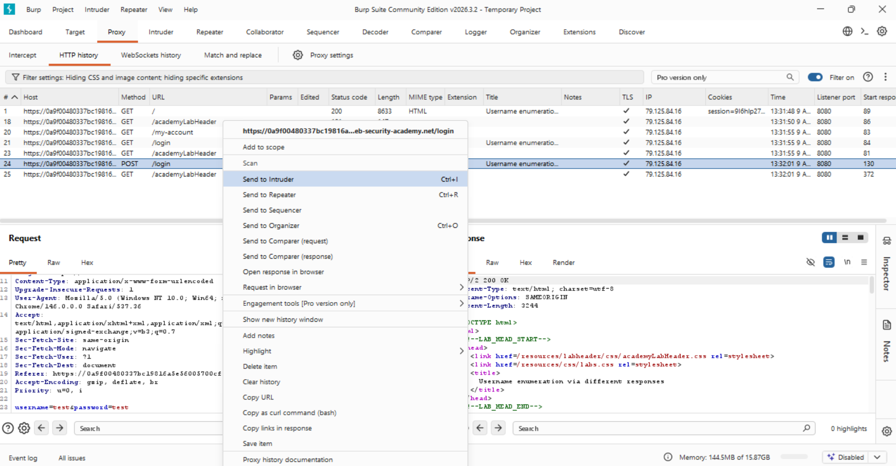
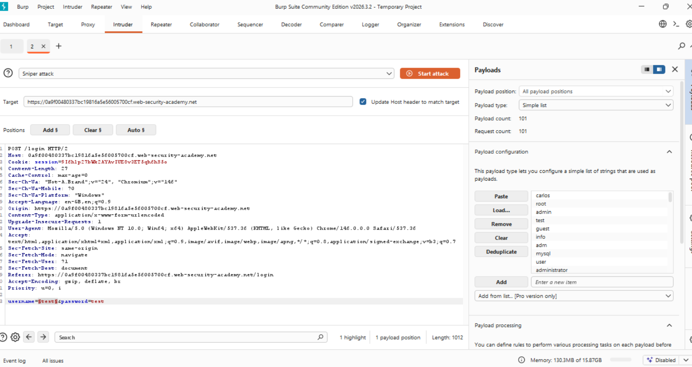
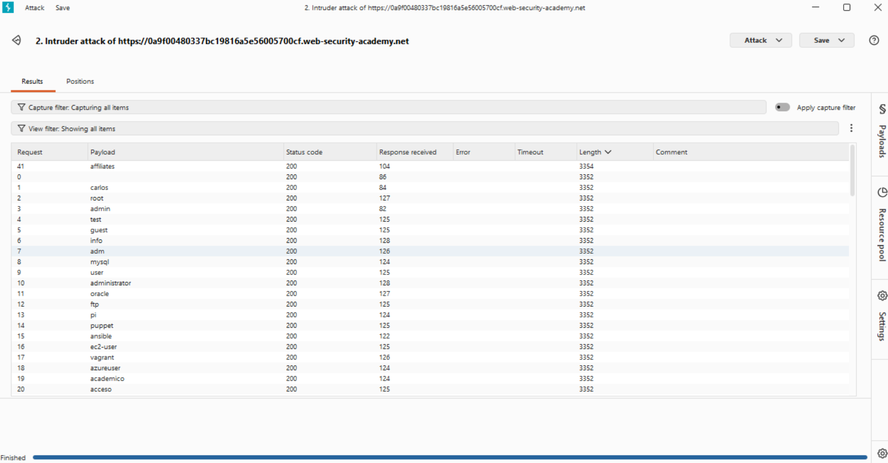
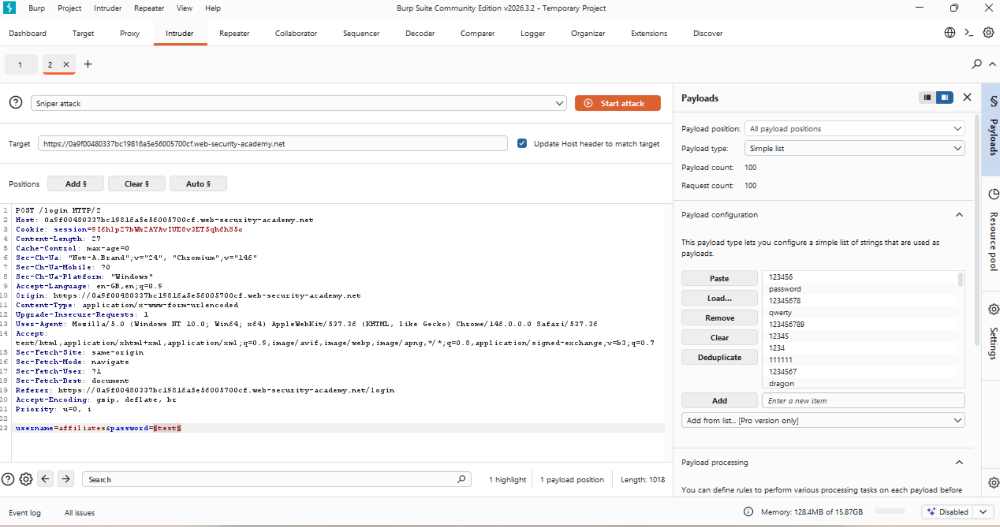
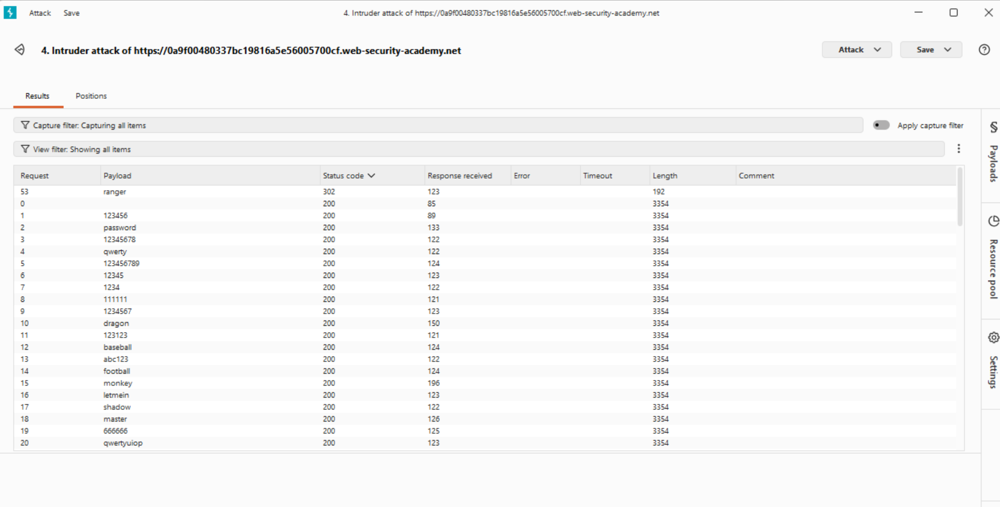
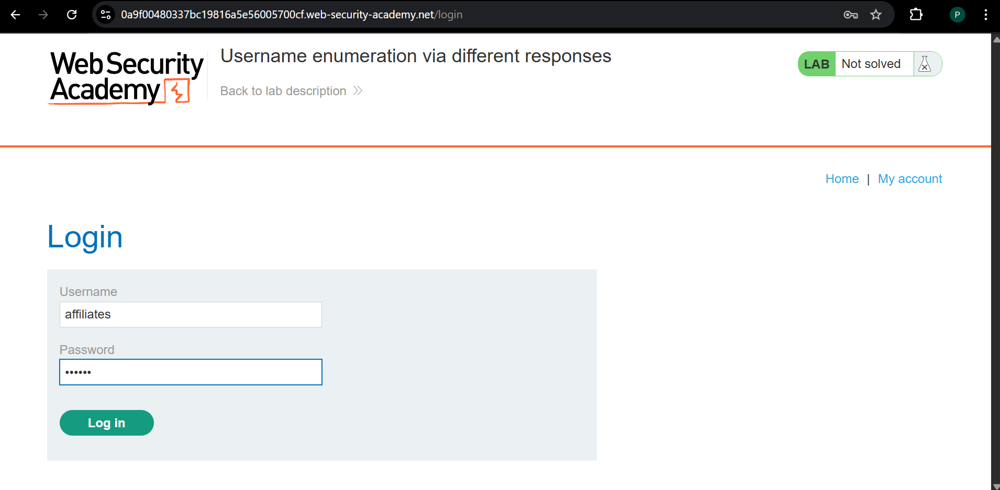
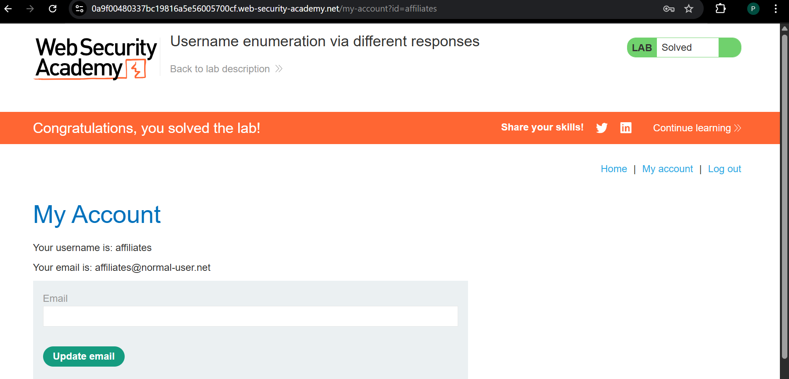

# Burp Suite – Authentication Bypass (Username Enumeration + Brute Force)

## 📌 Objective

Exploit authentication weaknesses by identifying valid usernames and brute-forcing passwords.

---

## 🛠️ Tools Used

* Burp Suite (Proxy + Intruder)

---

## 🔍 Attack Overview

### Step 1 – Capture Login Request

* Intercepted login request using Burp Proxy
* Sent request to Intruder

---

### Step 2 – Username Enumeration

* Injected payloads into `username`
* Tested 100 usernames

📊 Result:

* Most responses → Length: 3352
* One response → Length: 3354

✅ Valid username identified:

```
affiliates
```

---

### Step 3 – Password Brute Force

* Fixed username: `affiliates`
* Injected password list

📊 Result:

* Most responses → Status 200
* One response → Status 302

✅ Valid password identified:

```
ranger
```

---

### Step 4 – Successful Authentication

* Logged in with:

```
username: affiliates
password: ranger
```

✅ Access granted → Lab solved

---

## 🚨 Vulnerabilities Identified

* Username enumeration via response length differences
* Weak authentication protection
* No brute-force protection

---

## 🛡️ Mitigation Strategies

* Uniform error messages
* Rate limiting
* Account lockout after failed attempts
* CAPTCHA implementation

---

## 🧠 Key Takeaways

* Response length analysis is powerful
* Status codes reveal authentication behavior
* Burp Intruder is effective for automation

---

## 📸 Screenshots

### 1. Sending request to Intruder


---

### 2. Username payload configuration


---

### 3. Username enumeration result (different length)


---

### 4. Password payload configuration


---

### 5. Password brute-force result (302 response)


---

### 6. Successful login


---

### 7. Lab solved
