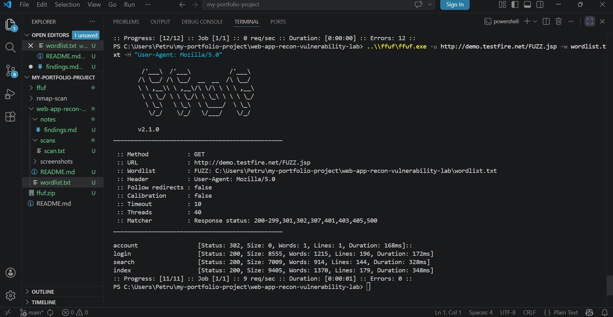
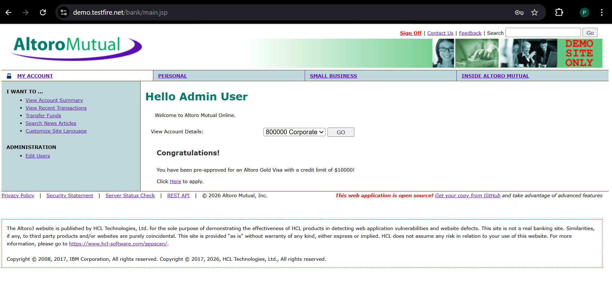
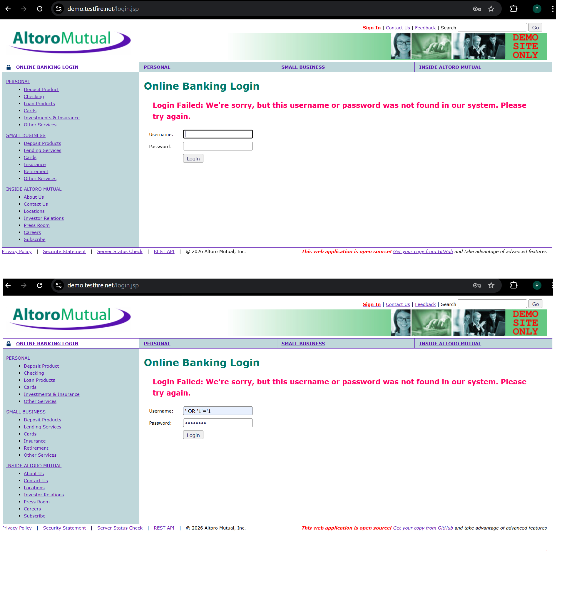
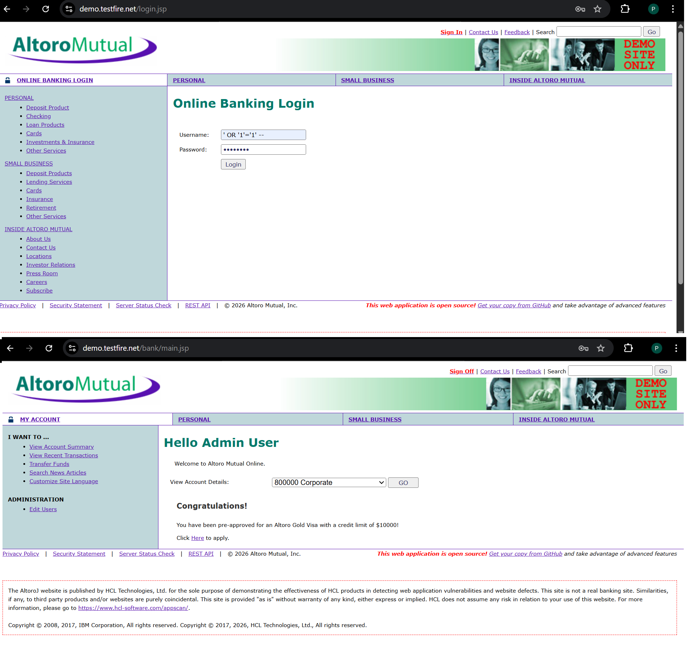
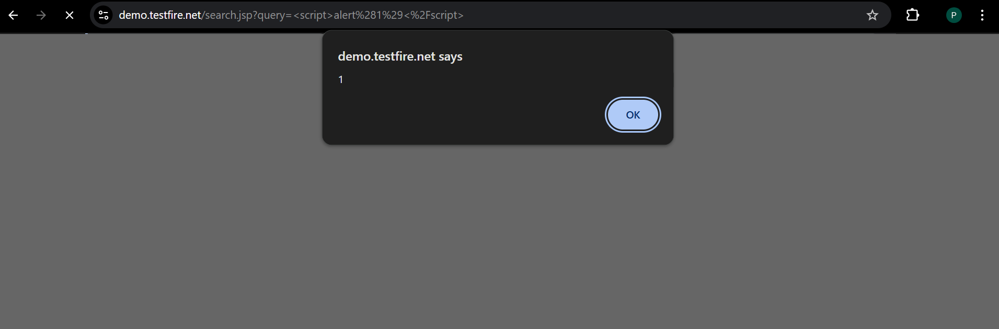
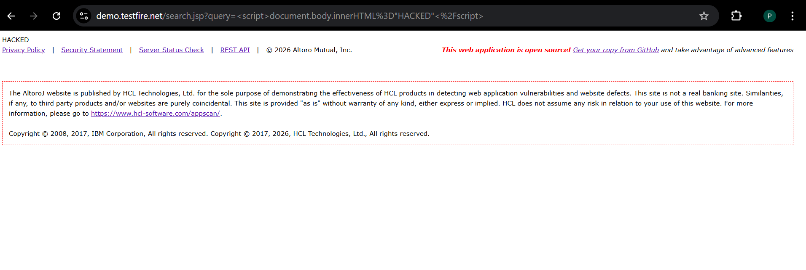

# Web Application Recon & Vulnerability Lab

## Overview
This project demonstrates basic web application reconnaissance and vulnerability discovery using a deliberately vulnerable web application.

The goal of this lab was to understand:
- how to discover hidden endpoints
- how authentication can be bypassed
- how input validation failures lead to vulnerabilities
- how to demonstrate real impact

## Target
http://demo.testfire.net

---

## Tools Used
- ffuf (endpoint discovery)
- Web browser (manual testing)
- Developer Tools (Inspect / Console)

---

## Reconnaissance

Endpoint discovery was performed using ffuf.

### Command used
```powershell
..\ffuf\ffuf.exe -u http://demo.testfire.net/FUZZ -w wordlist.txt
```

### Discovered endpoints
- login → HTTP 200
- search → HTTP 200
- account → HTTP 302

These endpoints were selected for further testing.

---

## Vulnerability 1: Default Credentials

### Description
The application allows login using default credentials.

### Payload
```
admin / admin
```

### Result
Successful login as an administrative user.

### Impact
- Unauthorized access
- Weak authentication

---

## Vulnerability 2: SQL Injection (Login Bypass)

### Description
The login form is vulnerable to SQL Injection.

### Test payload
```sql
' OR '1'='1
```

This caused a syntax error, confirming improper input handling.

### Exploit payload
```sql
' OR '1'='1' --
```

### Result
Authentication bypass without valid credentials.

### Impact
- Full authentication bypass
- Access to protected areas

---

## Vulnerability 3: Reflected XSS

### Description
The search functionality reflects user input without sanitization.

### Payload
```html
<script>alert(1)</script>
```

### Result
JavaScript executed in browser.

### Impact
- Script execution in user browser
- Possible session hijacking

---

## Advanced Impact

### Payload
```html
<script>document.body.innerHTML="HACKED"</script>
```

### Result
Page content replaced.

### Impact
- UI manipulation
- Page defacement
- Phishing potential

---

## Evidence

Screenshots are stored in `/screenshots`:

---

### FFUF Results


---

### Default Login


---

### SQL Injection Error


---

### SQL Injection Bypass


---

### XSS Alert


---

### XSS Defacement


---

## Remediation

### Authentication
- Remove default credentials
- Enforce strong passwords

### SQL Injection
- Use prepared statements
- Validate user input

### XSS
- Escape output
- Validate input
- Use CSP

---

## Conclusion
This project shows how weak authentication and poor input validation can lead to critical vulnerabilities like SQL Injection and XSS.